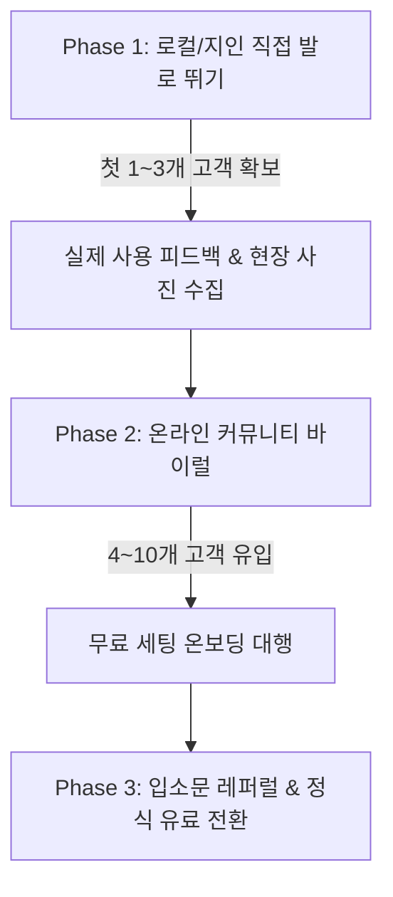

# 🚀 「현장노트」 초기 고객 확보 및 론칭 마케팅 실전 가이드 (Zero to One GTM Playbook)

> **문서 목적**: 현장노트 MVP 및 랜딩페이지 완성 후, 초기 1~10번째 실제 사용 고객(유료/무료 체험사)을 가장 빠르고 확실하게 확보하기 위한 실전 실행 매뉴얼입니다.  
> **기준일**: 2026-10-10  
> **핵심 원칙**: 초기 B2B 고객은 페이스북/인스타 광고로 모이지 않습니다. **"발로 뛰는 스케일되지 않는 일(Do things that don't scale)"**과 타깃 맞춤형 직접 접촉이 가장 빠릅니다.

---

## 📌 목차
1. [타깃 고객 분석 & 왜 지금 시작해야 하는가?](#1-타깃-고객-분석--왜-지금-시작해야-하는가)
2. [핵심 소구점 (대표님 마음을 여는 3가지 킬러 메시지)](#2-핵심-소구점-대표님-마음을-여는-3가지-킬러-메시지)
3. [단계별 초기 고객 확보 로드맵 (0명 ➔ 10개사)](#3-단계별-초기-고객-확보-로드맵-0명--10개사)
   - [Phase 1. 내 주변 & 로컬 직접 방문 (가장 확실한 첫 3개사)](#phase-1-내-주변--로컬-직접-방문-가장-확실한-첫-3개사)
   - [Phase 2. 타깃 온라인 커뮤니티 공략 (네이버 카페 & 오픈채팅)](#phase-2-타깃-온라인-커뮤니티-공략-네이버-카페--오픈채팅)
   - [Phase 3. 콜드 문자 및 팩스/DM 영업](#phase-3-콜드-문자-및-팩스dm-영업)
4. [복사해서 바로 쓰는 실전 영업 템플릿 모음](#4-복사해서-바로-쓰는-실전-영업-템플릿-모음)
   - [① 전화(콜드콜) 30초 스크립트](#-전화콜드콜-30초-스크립트)
   - [② 문자/카카오톡 제안 템플릿](#-문자카카오톡-제안-템플릿)
   - [③ 현장 방문(대면 미팅) 멘트](#-현장-방문대면-미팅-멘트)
   - [④ 커뮤니티 정보성 글 템플릿 (어그로 없이 신뢰 얻기)](#-커뮤니티-정보성-글-템플릿-어그로-없이-신뢰-얻기)
5. [홍보 개시 전 필수 테크/운영 체크리스트](#5-홍보-개시-전-필수-테크운영-체크리스트)
6. [성공을 위한 불문율 (Do's & Don'ts)](#6-성공을-위한-불문율-dos--donts)

---

## 1. 타깃 고객 분석 & 왜 지금 시작해야 하는가?

### 타깃 프로필
- **업종**: 소규모 미화·종합청소 용역, 건물 시설관리, 경비·보안, 소규모 오피스/상가 위탁관리업체
- **규모**: 현장 직원 5명 ~ 50명, 관리 현장 1 ~ 10개 내외
- **의사결정권자**: 대표이사, 관리이사, 총괄소장님 (40대 후반 ~ 60대)
- **현장 실무자**: 미화원, 시설기사, 경비원 (50대 ~ 70대 어르신 비율 높음)

### 그들의 숨겨진 "극심한 고통(Pain Points)"
1. **카카오톡 사진 지옥**: 단체 카톡방에 현장 사진이 하루 수십~수백 장씩 쏟아져 정리가 불가능함.
2. **보고서 야근**: 건물주나 원청사에 제출할 일일/월간 작업 보고서를 쓰느라 사진 골라내고 엑셀/PPT 붙여넣느라 퇴근을 못 함.
3. **현장 감시의 어려움**: "오늘 화장실 청소 제대로 했나?", "기계실 점검 돌았나?" 매번 전화로 확인할 수 없어 불안함.
4. **복잡한 앱에 대한 극심한 피로감**: 기존 대기업 ERP나 그룹웨어는 너무 복잡하고, 현장 어르신들이 앱 설치나 회원가입을 절대 못 하겠다고 반발함.

---

## 2. 핵심 소구점 (대표님 마음을 여는 3가지 킬러 메시지)

영업할 때 "클라우드 SaaS 솔루션", "Next.js 기술" 같은 IT 용어는 일절 빼야 합니다. 대신 다음 3가지만 이야기하세요.

| 소구 포인트 | 대표님에게 할 말 (핵심 카피) |
|---|---|
| **① 현장 저항 제로** | "새 앱 깔 필요 없습니다! 어르신 직원분들도 카톡 링크 누르면 3초 만에 사진 찍고 끝납니다." |
| **② 관리자 야근 제로** | "카톡으로 흩어지던 수백 장 사진, 현장별로 1초 만에 자동 정리되고 보고서로 바로 출력됩니다." |
| **③ 도입 부담 제로** | "대표님은 손 하나 까딱 안 하셔도 됩니다. 현장과 직원 등록은 제가 100% 무료로 다 세팅해 드립니다." |

---

## 3. 단계별 초기 고객 확보 로드맵 (0명 ➔ 10개사)



### Phase 1. 내 주변 & 로컬 직접 방문 (가장 확실한 첫 3개사)
> **소요 기간**: 1주 ~ 2주  
> **목표**: 돈 받지 않고 무조건 1~3개 업체가 1주일 동안 써보게 만들기

1. **내 생활 반경에서 시작하기**
   - 내가 살고 있는 아파트 관리사무소, 오피스텔 관리실, 상가 관리소에 박카스/커피 한 상자 들고 방문
   - "제가 소규모 빌딩 관리 프로그램 개발자인데, 소장님들이 카톡 사진 정리로 고생하신다는 이야기를 듣고 만들었습니다. 실제 현장에서 쓰시기에 어떤지 딱 1주일만 무료로 써보시고 솔직한 조언을 주실 수 있을까요?"
2. **네이버 지도 / 카카오맵 로컬 검색**
   - 검색어: `[내 지역구] 위탁관리`, `[내 지역구] 종합청소`, `[내 지역구] 건물관리`, `[내 지역구] 방역소독`
   - 주변 5~10km 이내 10~20개 업체의 전화번호/사무실 주소 리스트업
   - 전화 후 방문 약속 잡거나 직접 방문

### Phase 2. 타깃 온라인 커뮤니티 공략 (네이버 카페 & 오픈채팅)
> **소요 기간**: 2주 ~ 3주  
> **목표**: 5~10개 추가 잠재 고객 유입

1. **타깃 네이버 카페 가입 및 활동**
   - **주요 카페**:
     - `시설관리직들의 모임 (시모)`
     - `대한주택관리사협회 / 관리소장 커뮤니티`
     - `청소창업 / 위탁관리 정보 카페`
     - `건물관리 실무자 모임`
   - **접근법**: 절대 대놓고 "현장노트 쓰세요" 광고글을 올리지 마세요! (강퇴 위험)
   - **전략**:
     - ① "카톡으로 청소 사진 받다가 폰 터질 뻔한 썰" 같은 공감대 형성 글 작성
     - ② "현장 일일 점검표 엑셀 양식 무료 배포합니다" 글 작성 후 본문 하단에 "엑셀도 좋지만 폰으로 3초 만에 사진 찍는 모바일 웹도 만들어봤는데 필요하신 분 무료로 계정 열어드립니다" 언급
2. **카카오톡 오픈채팅방 침투**
   - 검색어: `시설관리`, `건물관리`, `청소용역`, `입주청소/정기청소`
   - 채팅방에서 일상 대화 나누며 고충(사진 취합, 원청 보고서 작성)이 나올 때 "저희는 이런 툴로 해결하고 있는데 혹시 필요하신 분 계신가요?" 하며 자연스럽게 랜딩페이지 전달

### Phase 3. 콜드 문자 및 팩스/DM 영업
> **소요 기간**: 3주차 이후  
> **목표**: 지속 가능한 리드 수집 파이프라인

- 소규모 용역 업체 대표님들은 스마트폰 문자메시지 및 사무실 팩스 확인율이 90% 이상입니다.
- 포털 사이트 지도에 등록된 대표 번호(휴대폰 번호)로 정중하고 간결한 3줄 제안 문자 발송.

---

## 4. 복사해서 바로 쓰는 실전 영업 템플릿 모음

### ① 전화(콜드콜) 30초 스크립트

> **나**: "여보세요, [회사명] 대표님(소장님) 통화 가능하실까요?"  
> **상대방**: "네, 무슨 일이시죠?"  
> **나**: "네 대표님, 바쁘실 텐데 30초만 시간 괜찮으실까요? 저희는 미화·건물관리 현장 전문 작업일지 솔루션 「현장노트」를 운영하고 있는데요. 현장 직원분들이 카톡으로 사진 수십 장 보내서 일일이 확인하고 보고서 만드시느라 번거로우셨죠?"  
> **상대방**: "그렇긴 한데..."  
> **나**: "직원분들 앱 설치도 필요 없이 카톡 링크 하나로 사진 찍고 완료하는 서비스인데요, 이번에 인근 지역 대표님들 5곳 한정으로 **직원 및 현장 세팅을 100% 무료**로 저희가 직접 다 해드리고 1개월 무료 체험을 열어드리고 있습니다. 혹시 문자로 1분짜리 소개 링크 하나만 남겨드려도 될까요?"  
> **상대방**: "네, 문자 하나 넣어보세요."  
> **나**: "감사합니다 대표님! 지금 바로 문자 남겨드리겠습니다. 좋은 하루 보내세요!"

---

### ② 문자/카카오톡 제안 템플릿

```text
[현장노트] 대표님, 카톡 사진 정리와 보고서 작성에 들이는 시간 90% 줄여드립니다.

안녕하세요 대표님! 건물·미화 현장 관리 전문 솔루션 「현장노트」입니다.

매일 단톡방에 올라오는 수백 장의 사진, 
월말마다 보고서 만드느라 야근하셨다면 딱 1분만 확인해 보세요!

✅ 현장 직원: 앱 설치 NO! 카톡 링크로 3초 만에 사진 전송
✅ 관리자: PC 대시보드에서 실시간 완료율 확인 & 원클릭 보고서
✅ 이번 달 혜택: 현장/직원 초기 세팅 100% 무료 대행 + 1개월 전액 무료

👉 현장노트 1분 둘러보기: [랜딩페이지 주소]
📞 편하게 문의하기: 010-XXXX-XXXX (카톡 상담 가능)

*신용카드 등록이나 위약금 일절 없습니다. 부담 없이 체험해 보세요!
```

---

### ③ 현장 방문(대면 미팅) 멘트

1. **인사 & 박카스 전달**:
   "소장님 안녕하세요! 날씨도 더운데(추운데) 고생이 많으십니다. 지나가다 들렀는데 시원한 음료수 하나 드시고 하세요."
2. **고충 질문(질문으로 대화 열기)**:
   "소장님, 보통 현장 미화/기사님들 작업하신 거 어떻게 보고받으세요? 카톡으로 받으시나요?"
3. **공감 및 해결책 제시**:
   "아이고, 카톡 사진 수십 개씩 쌓이면 나중에 건물주가 확인해달라고 할 때 찾기 진짜 힘드시죠? 저희가 바로 그 문제를 해결하려고 만든 모바일 현장노트입니다. 스마트폰에서 앱 설치도 안 해도 되고 버튼 한 번이면 끝납니다. 소장님 현장 하나만 제가 지금 바로 3분 만에 무료로 세팅해드릴 테니 오늘 한번 반장님께 시켜보시겠어요?"

---

### ④ 커뮤니티 정보성 글 템플릿 (어그로 없이 신뢰 얻기)

**제목**: `[정보] 현장 미화/시설 사진 카톡방 지옥 탈출하고 보고서 5분 만에 끝내는 법`  
**본문**:
> 안녕하세요 소장님들, 날씨 추운데 현장 관리하시느라 고생 많으십니다.  
> 저도 현장 소장님들과 협업하면서 가장 답답했던 게 바로 **'카톡 사진 폭탄'**이었습니다.  
> 직원이 10명만 넘어가도 사진이 하루에 100장씩 올라오고, 용량 차서 카톡 느려지고, 월말에 위탁사 보고서 쓸 때 사진 찾느라 밤새는 게 다반사였습니다.  
> 
> 그래서 최근에 현장 분들과 머리 맞대고 **'어르신들도 쓸 수 있는 가장 쉬운 방식'**으로 모바일 웹 기반 작업일지 툴을 만들어 적용해봤는데요,  
> 1. 어르신들은 앱 설치 안 하고 링크만 눌러서 사진 찰칵  
> 2. 관리자는 엑셀 다운로드나 출력 버튼 한 번에 사진 보고서 완성  
> 
> 확실히 보고서 작성 시간이 하루 2시간에서 5분으로 줄어들었습니다.  
> 혹시 비슷한 고민으로 야근하시는 소장님 계시면, 제가 시스템 세팅 무료로 도와드리고 체험 계정 만들어드릴 테니 댓글이나 쪽지 편하게 주세요! (상업적 목적 절대 아니고 실무 피드백 주실 분 환영합니다.)

---

## 5. 홍보 개시 전 필수 테크/운영 체크리스트

홍보 링크를 뿌리기 전에 반드시 아래 사항들을 점검해야 고객 이탈을 막을 수 있습니다.

- [ ] **1. 무료 체험 신청 모달(FreeTrialModal) 데이터 수신 점검**
  - 현재 신청 버튼 클릭 시 브라우저 상에만 완료 메시지가 뜨고 백엔드 DB 또는 알림(이메일, 카톡, 텔레그램)으로 대표님 전화번호가 전송되는지 확인해야 합니다.
  - *Tip*: 신청 즉시 내 휴대폰으로 알림이 오거나 Supabase `trial_requests` 테이블에 저장되도록 연결해두세요.
- [ ] **2. 1분 둘러보기용 데모 계정 준비**
  - 대표님들이 가입 전 "어떻게 생겼는지 바로 보고 싶다"고 할 때 보여줄 수 있는 시연용 아이디/비밀번호 준비  
    *(예: `demo@groundlog.kr` / 샘플 현장 3개, 작업 사진 10개 이상 등록된 상태)*
- [ ] **3. 카카오톡 1:1 오픈프로필 링크 배치**
  - 전화나 폼 작성이 부담스러운 분들을 위해 랜딩페이지 우측 하단 플로팅 버튼으로 "카카오톡 1:1 문의" 링크 연결.
- [ ] **4. 컨시어지 온보딩(Concierge Onboarding) 준비**
  - 무료 체험 신청이 들어오면 30분 이내에 전화해서 "대표님, 직원분 이름과 현장 이름만 문자로 보내주시면 제가 5분 안에 다 등록해드리겠습니다"라고 안내할 준비.

---

## 6. 성공을 위한 불문율 (Do's & Don'ts)

### ❌ 절대 하지 말아야 할 것 (Don'ts)
1. **페이스북/인스타그램 유료 광고에 돈 쓰지 마세요**: 건물관리 대표님들은 인스타 피드 보다가 B2B SaaS 결제 안 합니다. 100만 원 날리기 십상입니다.
2. **"알아서 써보세요" 하고 방치하지 마세요**: 가입만 시켜놓고 내버려두면 99%는 첫 화면만 보고 닫습니다. 초기 10개 고객은 내가 직접 손잡고 첫 작업을 완료시켜 줘야 합니다.
3. **현장 작업자(어르신)를 탓하지 마세요**: "반장님이 스마트폰을 잘 못 다루셔서..." ➔ 아닙니다. UI 버튼을 더 크게 만들고 글씨를 더 키워야 합니다.

### ⭕ 반드시 해야 할 것 (Do's)
1. **첫 3명의 '열성 팬(Superfan)' 만들기**: 단 2~3개 현장이라도 "이거 없으면 일 못 하겠다" 소리가 나올 때까지 매일 피드백 받고 수정해주세요.
2. **실제 사진 후기 확보하기**: 현장 소장님이 "우리 빌딩 보고서 작업 1시간 단축됐습니다"라고 한 줄 써준 후기를 캡처해서 랜딩페이지에 올리세요. 이 후기 하나가 광고 1,000만 원보다 강력합니다.
3. **즐겁고 당당하게 다가가기**: 대표님들의 오랜 골칫거리(야근, 카톡 사진 정리)를 공짜로 해결해 드리는 가치 있는 일을 하는 것입니다. 자신감을 가지세요!
