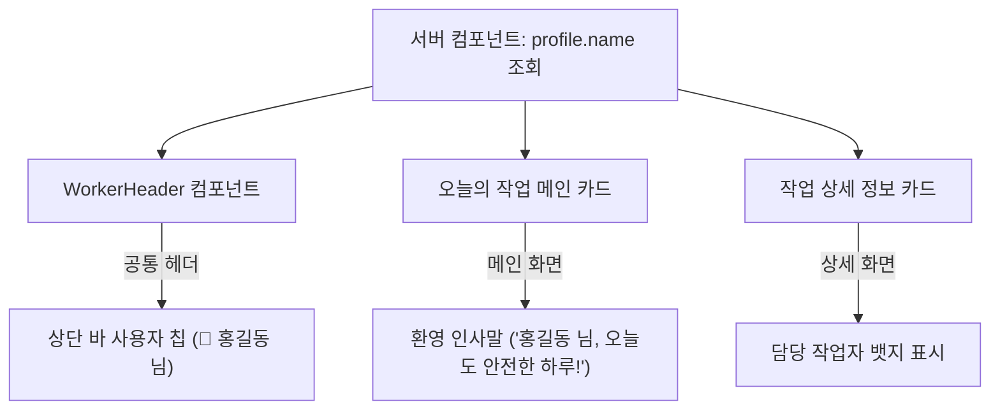

# [작업계획서] 현장직원 로그인 사용자 식별 UI 구현 및 모바일 UX 개선

> **문서 번호**: PLAN-20261010-01  
> **작성 일자**: 2026-10-10  
> **목표**: 현장직원(WORKER) 모바일 화면에서 현재 로그인된 사용자를 명확히 식별할 수 있도록 UI를 개선하여, 교대근무 및 공용 기기 사용 시 오작업을 방지하고 현장 신뢰도를 극대화  
> **저장 위치**: `docs/plans/2026-10-10_현장직원_로그인_사용자_표시_및_사용자경험_개선_작업계획서.md`  
> **대상 화면**: `WorkerHeader.tsx`, `app/my-tasks/page.tsx`, `app/my-tasks/[id]/page.tsx`, `app/handovers/page.tsx`

---

## 1. 추진 배경 및 필요성

### 1.1 현황 분석 및 문제의식
1. **사용자 식별 부재**:
   - 현장 작업자(미화원, 시설기사, 경비원)가 모바일로 접속했을 때, 현재 화면에 **"누가 로그인되어 있는지"** 확인되지 않음.
   - 현장 특성상 부부/동료 간 스마트폰을 함께 보거나, 전임자가 로그아웃하지 않은 상태에서 후임자가 작업할 경우 **타인의 계정으로 작업을 완료 체크하는 치명적인 혼선**이 발생할 위험이 있음.
2. **기존 코드 분석 결과**:
   - `app/my-tasks/page.tsx`, `app/my-tasks/[id]/page.tsx`, `app/handovers/page.tsx`에서 이미 서버 단에서 `profile.name`을 조회하여 `<WorkerHeader userName={profile.name} ... />`로 전달하고 있음.
   - 그러나 정작 `components/WorkerHeader.tsx` 내부에서 `userName` prop을 화면에 렌더링하는 태그가 누락되어 있었음.

### 1.2 개선 기대 효과
- **현장 실무 신뢰도 향상**: "홍길동 반장님"처럼 본인 이름이 명확히 표시되어 작업자 본인 계정임을 즉각 확신할 수 있음.
- **오작업 방지**: 타인 계정으로 접속된 상태를 즉시 인지하여 잘못된 체크 및 사진 전송 방지.
- **친근한 사용자 경험**: 출근 후 첫 화면에서 "안녕하세요, 홍길동 님! 👋" 환영 메시지를 제공하여 높은 심리적 만족감 선사.

---

## 2. 작업 범위 및 아키텍처 설계



### 2.1 세부 개선 화면 및 컴포넌트

| 구분 | 파일 경로 | 주요 개선 내용 |
|---|---|---|
| **컴포넌트 1** | `components/WorkerHeader.tsx` | - 공통 상단 헤더에 사용자명(`userName`) 및 역할/현장명 칩 추가<br/>- 모바일 좁은 화면(360px 이하)에서도 줄바꿈 깨짐 없는 반응형 배치 |
| **화면 1** | `app/my-tasks/page.tsx` | - 상단 일자/진행률 카드에 "안녕하세요, {profile.name} 님! 👋" 환영 문구 배치<br/>- 소속 현장명 직관적 강조 |
| **화면 2** | `app/my-tasks/[id]/page.tsx` | - 작업 상세 카드에 "담당 작업자: {profile.name}" 정보 영역 보강 |
| **화면 3** | `app/handovers/page.tsx` | - 상단 헤더 연동 확인 및 인수인계 등록 시 본인 이름 자동 연동 확인 |

---

## 3. 세부 작업 명세 (Task Breakdown)

### 📌 TASK 1. 공통 모바일 헤더(`WorkerHeader.tsx`) 사용자 표시 UI 구현
- **목표**: 모든 현장직원 화면(작업 목록, 상세, 인수인계) 상단에서 항상 현재 로그인 사용자를 한눈에 확인 가능하도록 구현.
- **상세 내용**:
  1. 헤더 우측 메뉴(인수인계, 로그아웃) 좌측 또는 중앙에 컴팩트한 사용자 뱃지 영역 구성:
     ```tsx
     <div className="flex items-center gap-1.5 px-2 py-1 rounded-full bg-zinc-100 text-xs font-semibold text-zinc-800">
       <span className="w-2 h-2 rounded-full bg-emerald-500" /> {/* 접속 상태 점 */}
       <span className="truncate max-w-[80px] sm:max-w-none">{userName || "직원"} 님</span>
     </div>
     ```
  2. 모바일 반응형 대응:
     - 화면 폭이 좁은 스마트폰(아이폰 SE, 갤럭시 소형 모델 등 360px대)에서도 버튼들이 잘리거나 2단으로 밀리지 않도록 여백 및 글자 크기 최적화.

### 📌 TASK 2. 오늘의 작업 메인 페이지(`app/my-tasks/page.tsx`) 개인화 UX 개선
- **목표**: 직원이 출근하여 접속했을 때 본인 계정임을 첫눈에 인지하고 동기부여를 받을 수 있도록 환영 메시지 추가.
- **상세 내용**:
  1. 오늘 일자/진행률 카드 상단에 개인화 환영 배너 추가:
     - `안녕하세요, {profile.name} 님! 👋`
     - `오늘 배정된 현장: {siteObj?.name || "전체 현장"}`
  2. 작업 진행률 및 상태가 본인의 작업임을 명확히 인지할 수 있도록 텍스트 다듬기.

### 📌 TASK 3. 작업 상세/완료 페이지(`app/my-tasks/[id]/page.tsx`) 담당자 명시
- **목표**: 개별 작업 체크리스트 작성 시 본인이 담당자로 정상 배정되어 있는지 확인.
- **상세 내용**:
  1. 작업 제목 상단/하단 메타 정보 영역에 `👤 작업자: {profile.name}` 뱃지 표시.
  2. 완료 버튼 클릭 시 해당 작업자의 이름으로 기록됨을 명시하여 책임감 부여.

---

## 4. UI/UX 디자인 가이드라인 (모바일 최우선)

1. **가독성 최우선 (어르신 친화 UI)**:
   - 폰트 크기는 최소 `12px` 이상 유지하고, 명도 대비를 확실하게 주어 야외 햇빛 아래에서도 이름이 선명하게 보이도록 구성.
2. **공간 효율성**:
   - 헤더 높이(`h-16`)를 초과하지 않고, 로고와 네비게이션 버튼 사이에 조화롭게 안착.
3. **상태 인디케이터**:
   - 초록색 점(`bg-emerald-500`)을 이름 옆에 두어 '현재 정상 접속 중'임을 시각적으로 전달.

---

## 5. 검증 및 테스트 계획

- [ ] **1. 빌드 및 타입 안정성 검증**: `npm run build` 실행하여 TypeScript 및 Next.js 린트 에러 0건 확인.
- [ ] **2. 뷰포트 반응형 검증**:
  - 모바일 소형 화면 (360px ~ 390px): 헤더 요소 줄바꿈 및 오버플로우 없음 확인.
  - 태블릿/PC 화면 (768px 이상): 자연스러운 정렬 확인.
- [ ] **3. 계정별 전환 테스트**:
  - 관리자 계정(`admin@groundlog.com`)과 직원 계정(`worker@groundlog.com`) 로그인 시 각각 올바른 이름과 역할이 헤더에 나타나는지 확인.
- [ ] **4. 화면 전환 일관성 테스트**:
  - `/my-tasks` ➔ `/my-tasks/[id]` ➔ `/handovers` 간 이동 시 헤더의 사용자 이름이 깜빡임 없이 유지되는지 확인.

---

## 6. 일정 및 실행 순서

1. **Step 1**: `WorkerHeader.tsx` 수정 (사용자 칩 및 반응형 스타일 적용)
2. **Step 2**: `app/my-tasks/page.tsx` 수정 (상단 환영 인사말 추가)
3. **Step 3**: `app/my-tasks/[id]/page.tsx` 수정 (작업 상세 담당자 표시)
4. **Step 4**: 로컬 빌드 및 반응형 뷰포트 검증
5. **Step 5**: Git 커밋 및 배포
